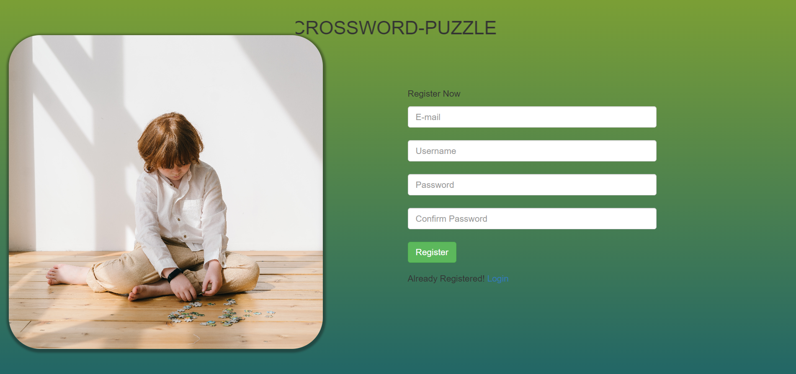
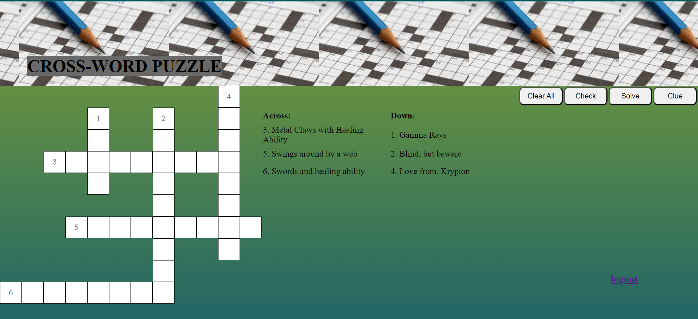
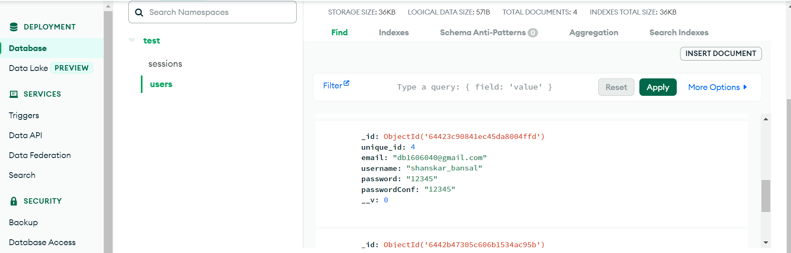
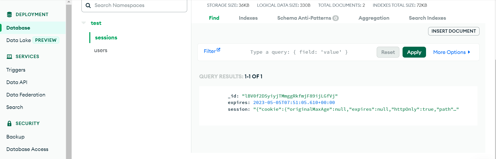

<p align="center">
  
</p>

<p align="center">
  
  
  
  
  
  
</p>

<p align="center">
  
  
</p>

<p align="center">
  
  
  
</p>

> **📌 Note:** This is a **showcase repository** containing documentation and screenshots only. The full source code is maintained in a **private repository**. If you're interested in collaboration or have questions, feel free to [reach out](#-author)!

---

## 📖 Table of Contents

<details>
<summary>Click to expand</summary>

- [🎯 About The Project](#-about-the-project)
- [✨ Key Features](#-key-features)
- [🏗️ System Architecture](#️-system-architecture)
- [🛠️ Tech Stack](#️-tech-stack)
- [📸 Screenshots](#-screenshots)
- [🚀 Getting Started](#-getting-started)
- [📡 API Endpoints](#-api-endpoints)
- [🗄️ Database Schema](#️-database-schema)
- [🎮 How To Play](#-how-to-play)
- [📂 Project Structure](#-project-structure)
- [🔐 Security Notes](#-security-notes)
- [🤝 Contributing](#-contributing)
- [📜 License](#-license)
- [👤 Author](#-author)

</details>

---

## 🎯 About The Project

**CrossVerse** is a full-stack, superhero-themed interactive crossword puzzle web application. Players register, log in, and solve a crossword puzzle filled with clues about iconic superheroes — from Wolverine to Spider-Man, Deadpool to Superman. The application features a complete user authentication system with registration, login, password recovery, and session management — all backed by MongoDB Atlas.

> _"Not just a puzzle — it's a universe of heroes waiting to be discovered, one letter at a time."_

### 🧠 What Makes CrossVerse Special?

| Feature | Description |
|---------|-------------|
| 🦸 **Superhero Theme** | Clues and answers are based on Marvel & DC characters |
| 🔐 **Full Auth System** | Register, Login, Logout, and Forgot Password flows |
| 🧩 **Interactive Grid** | Dynamic crossword grid generated via JavaScript |
| 💡 **Smart Clue System** | Limited clues (5 max) — use them wisely! |
| ✅ **Real-time Validation** | Instantly check your answers with color-coded feedback |
| 🧮 **Auto-Solve** | Stuck? Solve individual rows/columns with one click |
| 🎨 **Animated UI** | Sliding backgrounds, hover effects, and responsive design |
| 🗃️ **Persistent Sessions** | Sessions stored in MongoDB — stay logged in across visits |

---

## ✨ Key Features

```
╔══════════════════════════════════════════════════════════════╗
║                                                              ║
║   🔑 User Registration & Login with Email Validation         ║
║   🔒 Session Management via MongoDB Store                    ║
║   🔁 Forgot Password with Confirmation Matching              ║
║   🧩 Dynamic Crossword Grid (11×12 Matrix)                   ║
║   💡 Smart Clue System (5 clues per game)                    ║
║   ✅ Answer Validation with Visual Feedback (Red/White)       ║
║   🧮 Row/Column Auto-Solve Feature                           ║
║   🎨 Gradient UI + Animated Sliding Background               ║
║   📱 Responsive Design with Bootstrap                        ║
║   🚪 Secure Logout with Session Destruction                  ║
║                                                              ║
╚══════════════════════════════════════════════════════════════╝
```

---

## 🏗️ System Architecture

```
┌─────────────────────────────────────────────────────────────────┐
│                         CLIENT (Browser)                        │
│  ┌──────────┐  ┌──────────┐  ┌──────────┐  ┌──────────────┐   │
│  │ Register │  │  Login   │  │  Puzzle  │  │ Forgot Pass  │   │
│  │  (EJS)   │  │  (EJS)   │  │  (EJS)   │  │    (EJS)     │   │
│  └────┬─────┘  └────┬─────┘  └────┬─────┘  └──────┬───────┘   │
│       │              │              │               │           │
│       └──────────────┼──────────────┼───────────────┘           │
│                      │     AJAX (jQuery)                        │
└──────────────────────┼──────────────────────────────────────────┘
                       │
                       ▼
┌──────────────────────────────────────────────────────────────────┐
│                      SERVER (Node.js + Express)                  │
│                                                                  │
│  ┌─────────────────┐    ┌──────────────────────────────────┐    │
│  │   Routes Layer  │    │       Middleware Stack            │    │
│  │   (index.js)    │    │  • body-parser (JSON + URL)      │    │
│  │                 │    │  • express-session (MongoDB)      │    │
│  │  GET  /         │    │  • static file serving            │    │
│  │  POST /         │    │  • 404 error handler              │    │
│  │  GET  /login    │    │  • global error handler           │    │
│  │  POST /login    │    └──────────────────────────────────┘    │
│  │  GET  /profile  │                                            │
│  │  GET  /logout   │    ┌──────────────────────────────────┐    │
│  │  GET  /forget   │    │        Model Layer               │    │
│  │  POST /forget   │    │   User Schema (Mongoose)         │    │
│  └─────────────────┘    └──────────────────────────────────┘    │
└──────────────────────────────┬───────────────────────────────────┘
                               │
                               ▼
┌──────────────────────────────────────────────────────────────────┐
│                    DATABASE (MongoDB Atlas)                       │
│                                                                  │
│  ┌─────────────────────┐    ┌─────────────────────────────┐     │
│  │   Users Collection  │    │   Sessions Collection       │     │
│  │                     │    │                             │     │
│  │  • unique_id        │    │  • _id (session ID)        │     │
│  │  • email            │    │  • session (serialized)    │     │
│  │  • username         │    │  • expires                 │     │
│  │  • password         │    │                             │     │
│  │  • passwordConf     │    │                             │     │
│  └─────────────────────┘    └─────────────────────────────┘     │
└──────────────────────────────────────────────────────────────────┘
```

---

## 🛠️ Tech Stack

<details>
<summary><b>🖥️ Backend</b></summary>

| Technology | Purpose |
|-----------|---------|
| **Node.js** | Server-side JavaScript runtime |
| **Express.js** | Web application framework |
| **Mongoose** | MongoDB ODM for data modeling |
| **express-session** | Session middleware |
| **connect-mongo** | MongoDB session store |
| **body-parser** | Request body parsing middleware |
| **dotenv** | Environment variable management |
| **EJS** | Embedded JavaScript templating engine |

</details>

<details>
<summary><b>🎨 Frontend</b></summary>

| Technology | Purpose |
|-----------|---------|
| **HTML5 / CSS3** | Markup & Styling |
| **JavaScript (ES5)** | Client-side game logic |
| **jQuery 3.2.1** | DOM manipulation & AJAX |
| **Bootstrap 3.3.7** | Responsive UI framework |

</details>

<details>
<summary><b>🗃️ Database</b></summary>

| Technology | Purpose |
|-----------|---------|
| **MongoDB Atlas** | Cloud-hosted NoSQL database |
| **Mongoose Schema** | Data validation & modeling |

</details>

---

## 📸 Screenshots

<details>
<summary><b>📋 Click to view Screenshots</b></summary>

### 📝 Registration Page
<p align="center">
  
</p>

### 🎮 Game Interface
<p align="center">
  
</p>

### 👤 User Profile / Game Page
<p align="center">
  
</p>

### 🔑 Forgot Password
<p align="center">
  
</p>

### 🗄️ User Database (MongoDB)
<p align="center">
  
</p>

### 🔐 Session Database (MongoDB)
<p align="center">
  
</p>

</details>

---

## 🚀 Getting Started

### Prerequisites

Make sure you have the following installed:

- **Node.js** (v14 or higher) → [Download](https://nodejs.org/)
- **npm** (comes with Node.js)
- **MongoDB Atlas** account → [Sign up](https://www.mongodb.com/cloud/atlas)
- **Git** → [Download](https://git-scm.com/)

### 🔒 Source Code Access

> The source code for CrossVerse is maintained in a **private repository**. This showcase repo is meant for documentation, demonstration, and portfolio purposes.
>
> **Interested in the code?** Contact me via [GitHub](https://github.com/shanskarBansal) for collaboration requests or access.

### General Setup (If You Have Access)

```bash
# 1️⃣ Clone the private repository (requires access)
git clone https://github.com/shanskarBansal/CrossVerse.git

# 2️⃣ Navigate to the project directory
cd CrossVerse

# 3️⃣ Install dependencies
npm install

# 4️⃣ Create a .env file (see Environment Variables section below)
touch .env

# 5️⃣ Start the server
npm start
```

### Environment Variables

Create a `.env` file in the root directory:

```env
PORT=3001
MONGODB_URI=mongodb+srv://<username>:<password>@<cluster>.mongodb.net/?retryWrites=true&w=majority
SESSION_SECRET=your_secret_key_here
```

### Quick Start

```bash
# After installation, open your browser and navigate to:
http://localhost:3001        # Registration Page
http://localhost:3001/login  # Login Page
```

---

## 📡 API Endpoints

| Method | Endpoint | Description | Auth Required |
|--------|----------|-------------|:------------:|
| `GET` | `/` | Registration page | ❌ |
| `POST` | `/` | Register a new user | ❌ |
| `GET` | `/login` | Login page | ❌ |
| `POST` | `/login` | Authenticate user | ❌ |
| `GET` | `/profile` | Game page (crossword puzzle) | ✅ |
| `GET` | `/logout` | Destroy session & logout | ✅ |
| `GET` | `/forgetpass` | Forgot password page | ❌ |
| `POST` | `/forgetpass` | Reset password | ❌ |

### Request/Response Examples

<details>
<summary><b>POST /  — Register User</b></summary>

**Request Body:**
```json
{
  "email": "hero@crossverse.com",
  "username": "wolverine_fan",
  "password": "adamantium123",
  "passwordConf": "adamantium123"
}
```

**Success Response:**
```json
{
  "Success": "You are registered, You can login now."
}
```

**Error Response (Email exists):**
```json
{
  "Success": "Email is already used."
}
```

</details>

<details>
<summary><b>POST /login — Authenticate User</b></summary>

**Request Body:**
```json
{
  "email": "hero@crossverse.com",
  "password": "adamantium123"
}
```

**Success Response:**
```json
{
  "Success": "Success!"
}
```

</details>

---

## 🗄️ Database Schema

### User Model

```javascript
const userSchema = new Schema({
  unique_id : Number,     // Auto-incremented unique identifier
  email     : String,     // User's email (used for login)
  username  : String,     // Display name
  password  : String,     // User's password
  passwordConf : String   // Password confirmation
});
```

### Entity Relationship

```
┌──────────────────────────┐
│        USER              │
├──────────────────────────┤
│  unique_id  : Number  PK│
│  email      : String  UK│
│  username   : String    │
│  password   : String    │
│  passwordConf: String   │
├──────────────────────────┤
│  Indexes:                │
│  • _id (MongoDB default) │
│  • email (unique lookup) │
└──────────────────────────┘
         │
         │ 1:N (via session.userId)
         ▼
┌──────────────────────────┐
│       SESSION            │
├──────────────────────────┤
│  _id     : String     PK│
│  session : Object       │
│  expires : Date         │
└──────────────────────────┘
```

---

## 🎮 How To Play

```
  ┌──────────────────────────────────────────┐
  │          🎮 CrossVerse Game Guide         │
  ├──────────────────────────────────────────┤
  │                                          │
  │  1️⃣  Register with your email           │
  │  2️⃣  Login to access the puzzle         │
  │  3️⃣  Read the superhero clues           │
  │  4️⃣  Fill in the crossword grid         │
  │  5️⃣  Use these buttons:                 │
  │                                          │
  │     🔍 Check  → Validates your answers   │
  │        (Red = Wrong, White = Correct)    │
  │                                          │
  │     💡 Clue   → Reveals selected cell    │
  │        (Limited to 5 clues!)             │
  │                                          │
  │     🧮 Solve  → Solves the row/column    │
  │        of the selected cell              │
  │                                          │
  │     🗑️ Clear  → Clears all your inputs   │
  │                                          │
  ├──────────────────────────────────────────┤
  │                                          │
  │  📋 Crossword Hints:                     │
  │                                          │
  │  ACROSS:                                 │
  │   3 → Metal Claws with Healing Ability   │
  │   5 → Swings around by a web            │
  │   6 → Swords and healing ability         │
  │                                          │
  │  DOWN:                                   │
  │   1 → Gamma Rays                         │
  │   2 → Blind, but beware                  │
  │   4 → Love from Krypton                  │
  │                                          │
  └──────────────────────────────────────────┘
```

<details>
<summary>🤫 <b>Spoiler: Answer Key</b></summary>

| # | Direction | Answer | Hero |
|---|-----------|--------|------|
| 1 | Down | HULK | The Incredible Hulk |
| 2 | Down | DAREDEVIL | Daredevil |
| 3 | Across | WOLVERINE | Wolverine (X-Men) |
| 4 | Down | SUPERMAN | Superman (DC) |
| 5 | Across | SPIDERMAN | Spider-Man |
| 6 | Across | DEADPOOL | Deadpool |

</details>

---

## 📂 Project Structure

```
CrossVerse/
├── 📄 server.js              # Express server entry point
├── 📄 package.json           # Project metadata & dependencies
├── 📄 .env                   # Environment variables (not in repo)
├── 📄 CNAME                  # Custom domain configuration
├── 📄 _config.yml            # GitHub Pages config
│
├── 📁 models/
│   └── 📄 user.js            # Mongoose User schema
│
├── 📁 routes/
│   └── 📄 index.js           # All route handlers (auth + game)
│
├── 📁 views/
│   ├── 📄 index.ejs          # Registration page
│   ├── 📄 login.ejs          # Login page
│   ├── 📄 data.ejs           # Game page (crossword puzzle)
│   ├── 📄 forget.ejs         # Forgot password page
│   │
│   ├── 📁 css/
│   │   ├── 📄 main.css       # Global styles + animations
│   │   └── 🖼️ image1-5.jpg   # Background & decorative images
│   │
│   └── 📁 js/
│       └── 📄 game.js        # Crossword puzzle game logic
│
└── 📁 docs/
    ├── 🖼️ Register.png       # Registration screenshot
    ├── 🖼️ data.png           # Game page screenshot
    ├── 🖼️ forgetpass.png     # Forgot password screenshot
    ├── 🖼️ userdb.png         # User DB screenshot
    └── 🖼️ sessiondbr.png     # Session DB screenshot
```

---

## 🔐 Security Notes

> ⚠️ **This is a learning/demo project.** The following security improvements should be made before any production use:

| Current State | Recommended Improvement |
|--------------|------------------------|
| Passwords stored in plain text | Use **bcrypt** for hashing |
| MongoDB URI hardcoded | Use **environment variables** (`.env`) |
| No input sanitization | Add **express-validator** |
| No CSRF protection | Add **csurf** middleware |
| No rate limiting | Add **express-rate-limit** |
| No HTTPS enforcement | Use **helmet** + SSL |
| Session secret is static | Use **strong random secret** |

---

## 🛣️ Roadmap

- [x] User Registration & Login
- [x] Crossword Puzzle Game Engine
- [x] Session Management with MongoDB
- [x] Password Reset Functionality
- [ ] 🔐 Password Hashing with bcrypt
- [ ] 🧩 Multiple Puzzle Levels
- [ ] 🏆 Leaderboard & Scoring System
- [ ] ⏱️ Timer-based Challenges
- [ ] 📱 Mobile-Responsive Redesign
- [ ] 🌙 Dark Mode
- [ ] 🧪 Unit & Integration Tests

---

## 🤝 Contributing

Contributions make the open-source community an amazing place to learn, inspire, and create. Any contributions you make are **greatly appreciated**!

```bash
# 1. Fork the Project
# 2. Create your Feature Branch
git checkout -b feature/AmazingFeature

# 3. Commit your Changes
git commit -m "Add some AmazingFeature"

# 4. Push to the Branch
git push origin feature/AmazingFeature

# 5. Open a Pull Request
```

---

## 📜 License

Distributed under the **ISC License**. See `LICENSE` for more information.

---

## 👤 Author

<p align="center">
  
</p>

<p align="center">
  <a href="https://github.com/shanskarBansal"></a>
  <a href="https://shanskarbansal.com"></a>
</p>

---

<p align="center">
  
</p>

<p align="center">
  Made with ❤️ and ☕ by <a href="https://github.com/shanskarBansal">shanskarBansal</a>
</p>

