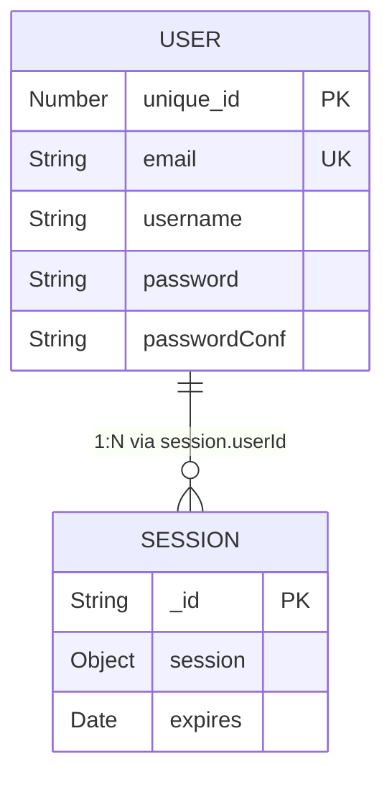

<p align="center">
  
</p>

<p align="center">
  
  
  
  
  
  
</p>

<p align="center">
  
  
</p>

<p align="center">
  
  
  
</p>

> **📌 Note:** This is a **showcase repository** containing documentation and screenshots only. The full source code is maintained in a **private repository**. If you're interested in collaboration or have questions, feel free to [reach out](#-author)!

---

## 📖 Table of Contents

<details>
<summary>Click to expand</summary>

- [🎯 About The Project](#-about-the-project)
- [✨ Key Features](#-key-features)
- [🏗️ System Architecture](#️-system-architecture)
- [🛠️ Tech Stack](#️-tech-stack)
- [📸 Screenshots](#-screenshots)
- [🚀 Getting Started](#-getting-started)
- [📡 API Endpoints](#-api-endpoints)
- [🗄️ Database Schema](#️-database-schema)
- [🎮 How To Play](#-how-to-play)
- [📂 Project Structure](#-project-structure)
- [🔐 Security Notes](#-security-notes)
- [🤝 Contributing](#-contributing)
- [📜 License](#-license)
- [👤 Author](#-author)

</details>

---

## 🎯 About The Project

**CrossVerse** is a full-stack, superhero-themed interactive crossword puzzle web application. Players register, log in, and solve a crossword puzzle filled with clues about iconic superheroes — from Wolverine to Spider-Man, Deadpool to Superman. The application features a complete user authentication system with registration, login, password recovery, and session management — all backed by MongoDB Atlas.

> _"Not just a puzzle — it's a universe of heroes waiting to be discovered, one letter at a time."_

### 🧠 What Makes CrossVerse Special?

| Feature | Description |
|---------|-------------|
| 🦸 **Superhero Theme** | Clues and answers are based on Marvel & DC characters |
| 🔐 **Full Auth System** | Register, Login, Logout, and Forgot Password flows |
| 🧩 **Interactive Grid** | Dynamic crossword grid generated via JavaScript |
| 💡 **Smart Clue System** | Limited clues (5 max) — use them wisely! |
| ✅ **Real-time Validation** | Instantly check your answers with color-coded feedback |
| 🧮 **Auto-Solve** | Stuck? Solve individual rows/columns with one click |
| 🎨 **Animated UI** | Sliding backgrounds, hover effects, and responsive design |
| 🗃️ **Persistent Sessions** | Sessions stored in MongoDB — stay logged in across visits |

---

## ✨ Key Features

- 🔑 User Registration & Login with Email Validation
- 🔒 Session Management via MongoDB Store
- 🔁 Forgot Password with Confirmation Matching
- 🧩 Dynamic Crossword Grid (11×12 Matrix)
- 💡 Smart Clue System (5 clues per game)
- ✅ Answer Validation with Visual Feedback (Red/White)
- 🧮 Row/Column Auto-Solve Feature
- 🎨 Gradient UI + Animated Sliding Background
- 📱 Responsive Design with Bootstrap
- 🚪 Secure Logout with Session Destruction

---

## 🏗️ System Architecture

```mermaid
flowchart TB
    subgraph CLIENT["🖥️ Client (Browser)"]
        R["Register\n(EJS)"] & L["Login\n(EJS)"] & P["Puzzle\n(EJS)"] & F["Forgot Pass\n(EJS)"]
    end

    AJAX["AJAX (jQuery)"]

    subgraph SERVER["⚙️ Server (Node.js + Express)"]
        ROUTES["Routes Layer\n(index.js)\nGET / · POST /\nGET /login · POST /login\nGET /profile · GET /logout\nGET /forget · POST /forget"]
        MW["Middleware Stack\nbody-parser · express-session\nstatic files · error handlers"]
        MODEL["Model Layer\nUser Schema (Mongoose)"]
    end

    subgraph DB["🗄️ MongoDB Atlas"]
        USERS[("Users Collection\nunique_id · email\nusername · password")]
        SESSIONS[("Sessions Collection\n_id · session · expires")]
    end

    R & L & P & F --> AJAX
    AJAX --> ROUTES
    ROUTES <--> MW
    ROUTES <--> MODEL
    MODEL --> USERS & SESSIONS
```



---

## 🛠️ Tech Stack

<details>
<summary><b>🖥️ Backend</b></summary>

| Technology | Purpose |
|-----------|---------|
| **Node.js** | Server-side JavaScript runtime |
| **Express.js** | Web application framework |
| **Mongoose** | MongoDB ODM for data modeling |
| **express-session** | Session middleware |
| **connect-mongo** | MongoDB session store |
| **body-parser** | Request body parsing middleware |
| **dotenv** | Environment variable management |
| **EJS** | Embedded JavaScript templating engine |

</details>

<details>
<summary><b>🎨 Frontend</b></summary>

| Technology | Purpose |
|-----------|---------|
| **HTML5 / CSS3** | Markup & Styling |
| **JavaScript (ES5)** | Client-side game logic |
| **jQuery 3.2.1** | DOM manipulation & AJAX |
| **Bootstrap 3.3.7** | Responsive UI framework |

</details>

<details>
<summary><b>🗃️ Database</b></summary>

| Technology | Purpose |
|-----------|---------|
| **MongoDB Atlas** | Cloud-hosted NoSQL database |
| **Mongoose Schema** | Data validation & modeling |

</details>

---

## 📸 Screenshots

<details>
<summary><b>📋 Click to view Screenshots</b></summary>

### 📝 Registration Page
<p align="center">
  
</p>

### 🎮 Game Interface
<p align="center">
  
</p>

### 👤 User Profile / Game Page
<p align="center">
  
</p>

### 🔑 Forgot Password
<p align="center">
  
</p>

### 🗄️ User Database (MongoDB)
<p align="center">
  
</p>

### 🔐 Session Database (MongoDB)
<p align="center">
  
</p>

</details>

---

## 🚀 Getting Started

### Prerequisites

Make sure you have the following installed:

- **Node.js** (v14 or higher) → [Download](https://nodejs.org/)
- **npm** (comes with Node.js)
- **MongoDB Atlas** account → [Sign up](https://www.mongodb.com/cloud/atlas)
- **Git** → [Download](https://git-scm.com/)

### 🔒 Source Code Access

> The source code for CrossVerse is maintained in a **private repository**. This showcase repo is meant for documentation, demonstration, and portfolio purposes.
>
> **Interested in the code?** Contact me via [GitHub](https://github.com/shanskarBansal) for collaboration requests or access.

### General Setup (If You Have Access)

```bash
# 1️⃣ Clone the private repository (requires access)
git clone https://github.com/shanskarBansal/CrossVerse.git

# 2️⃣ Navigate to the project directory
cd CrossVerse

# 3️⃣ Install dependencies
npm install

# 4️⃣ Create a .env file (see Environment Variables section below)
touch .env

# 5️⃣ Start the server
npm start
```

### Environment Variables

Create a `.env` file in the root directory:

```env
PORT=3001
MONGODB_URI=mongodb+srv://<username>:<password>@<cluster>.mongodb.net/?retryWrites=true&w=majority
SESSION_SECRET=your_secret_key_here
```

### Quick Start

```bash
# After installation, open your browser and navigate to:
http://localhost:3001        # Registration Page
http://localhost:3001/login  # Login Page
```

---

## 📡 API Endpoints

| Method | Endpoint | Description | Auth Required |
|--------|----------|-------------|:------------:|
| `GET` | `/` | Registration page | ❌ |
| `POST` | `/` | Register a new user | ❌ |
| `GET` | `/login` | Login page | ❌ |
| `POST` | `/login` | Authenticate user | ❌ |
| `GET` | `/profile` | Game page (crossword puzzle) | ✅ |
| `GET` | `/logout` | Destroy session & logout | ✅ |
| `GET` | `/forgetpass` | Forgot password page | ❌ |
| `POST` | `/forgetpass` | Reset password | ❌ |

### Request/Response Examples

<details>
<summary><b>POST /  — Register User</b></summary>

**Request Body:**
```json
{
  "email": "hero@crossverse.com",
  "username": "wolverine_fan",
  "password": "adamantium123",
  "passwordConf": "adamantium123"
}
```

**Success Response:**
```json
{
  "Success": "You are registered, You can login now."
}
```

**Error Response (Email exists):**
```json
{
  "Success": "Email is already used."
}
```

</details>

<details>
<summary><b>POST /login — Authenticate User</b></summary>

**Request Body:**
```json
{
  "email": "hero@crossverse.com",
  "password": "adamantium123"
}
```

**Success Response:**
```json
{
  "Success": "Success!"
}
```

</details>

---

## 🗄️ Database Schema

### User Model

```javascript
const userSchema = new Schema({
  unique_id : Number,     // Auto-incremented unique identifier
  email     : String,     // User's email (used for login)
  username  : String,     // Display name
  password  : String,     // User's password
  passwordConf : String   // Password confirmation
});
```

### Entity Relationship



---

## 🎮 How To Play

1. Register with your email
2. Login to access the puzzle
3. Read the superhero clues
4. Fill in the crossword grid
5. Use the game buttons:

| Button | Action |
|--------|--------|
| 🔍 **Check** | Validates your answers (Red = Wrong, White = Correct) |
| 💡 **Clue** | Reveals the selected cell (limited to 5 clues!) |
| 🧮 **Solve** | Solves the entire row/column of the selected cell |
| 🗑️ **Clear** | Clears all your inputs |

**Crossword Hints:**

| # | Direction | Hint |
|---|-----------|------|
| 1 | ⬇️ Down | Gamma Rays |
| 2 | ⬇️ Down | Blind, but beware |
| 3 | ➡️ Across | Metal Claws with Healing Ability |
| 4 | ⬇️ Down | Love from Krypton |
| 5 | ➡️ Across | Swings around by a web |
| 6 | ➡️ Across | Swords and healing ability |

<details>
<summary>🤫 <b>Spoiler: Answer Key</b></summary>

| # | Direction | Answer | Hero |
|---|-----------|--------|------|
| 1 | Down | HULK | The Incredible Hulk |
| 2 | Down | DAREDEVIL | Daredevil |
| 3 | Across | WOLVERINE | Wolverine (X-Men) |
| 4 | Down | SUPERMAN | Superman (DC) |
| 5 | Across | SPIDERMAN | Spider-Man |
| 6 | Across | DEADPOOL | Deadpool |

</details>

---

## 📂 Project Structure

```
CrossVerse/
├── 📄 server.js              # Express server entry point
├── 📄 package.json           # Project metadata & dependencies
├── 📄 .env                   # Environment variables (not in repo)
├── 📄 CNAME                  # Custom domain configuration
├── 📄 _config.yml            # GitHub Pages config
│
├── 📁 models/
│   └── 📄 user.js            # Mongoose User schema
│
├── 📁 routes/
│   └── 📄 index.js           # All route handlers (auth + game)
│
├── 📁 views/
│   ├── 📄 index.ejs          # Registration page
│   ├── 📄 login.ejs          # Login page
│   ├── 📄 data.ejs           # Game page (crossword puzzle)
│   ├── 📄 forget.ejs         # Forgot password page
│   │
│   ├── 📁 css/
│   │   ├── 📄 main.css       # Global styles + animations
│   │   └── 🖼️ image1-5.jpg   # Background & decorative images
│   │
│   └── 📁 js/
│       └── 📄 game.js        # Crossword puzzle game logic
│
└── 📁 docs/
    ├── 🖼️ Register.png       # Registration screenshot
    ├── 🖼️ data.png           # Game page screenshot
    ├── 🖼️ forgetpass.png     # Forgot password screenshot
    ├── 🖼️ userdb.png         # User DB screenshot
    └── 🖼️ sessiondbr.png     # Session DB screenshot
```

---

## 🔐 Security Notes

> ⚠️ **This is a learning/demo project.** The following security improvements should be made before any production use:

| Current State | Recommended Improvement |
|--------------|------------------------|
| Passwords stored in plain text | Use **bcrypt** for hashing |
| MongoDB URI hardcoded | Use **environment variables** (`.env`) |
| No input sanitization | Add **express-validator** |
| No CSRF protection | Add **csurf** middleware |
| No rate limiting | Add **express-rate-limit** |
| No HTTPS enforcement | Use **helmet** + SSL |
| Session secret is static | Use **strong random secret** |

---

## 🛣️ Roadmap

- [x] User Registration & Login
- [x] Crossword Puzzle Game Engine
- [x] Session Management with MongoDB
- [x] Password Reset Functionality
- [ ] 🔐 Password Hashing with bcrypt
- [ ] 🧩 Multiple Puzzle Levels
- [ ] 🏆 Leaderboard & Scoring System
- [ ] ⏱️ Timer-based Challenges
- [ ] 📱 Mobile-Responsive Redesign
- [ ] 🌙 Dark Mode
- [ ] 🧪 Unit & Integration Tests

---

## 🤝 Contributing

Contributions make the open-source community an amazing place to learn, inspire, and create. Any contributions you make are **greatly appreciated**!

```bash
# 1. Fork the Project
# 2. Create your Feature Branch
git checkout -b feature/AmazingFeature

# 3. Commit your Changes
git commit -m "Add some AmazingFeature"

# 4. Push to the Branch
git push origin feature/AmazingFeature

# 5. Open a Pull Request
```

---

## 📜 License

Distributed under the **ISC License**. See `LICENSE` for more information.

---

## 👤 Author

<p align="center">
  
</p>

<p align="center">
  <a href="https://github.com/shanskarBansal"></a>
  <a href="https://shanskarbansal.com"></a>
</p>

---

<p align="center">
  
</p>

<p align="center">
  Made with ❤️ and ☕ by <a href="https://github.com/shanskarBansal">shanskarBansal</a>
</p>

